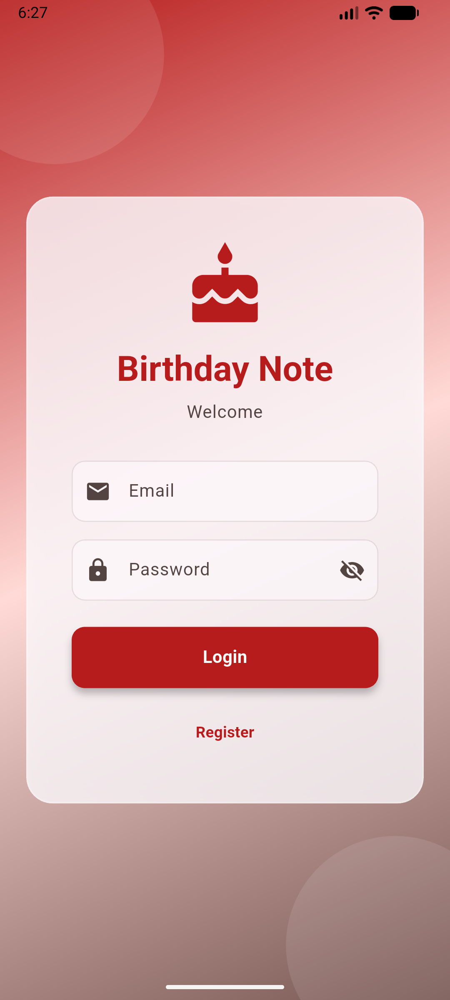
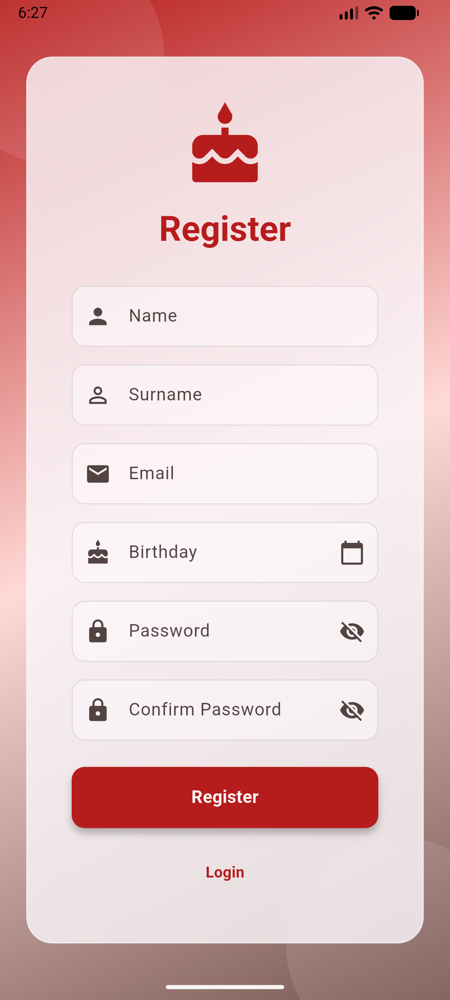
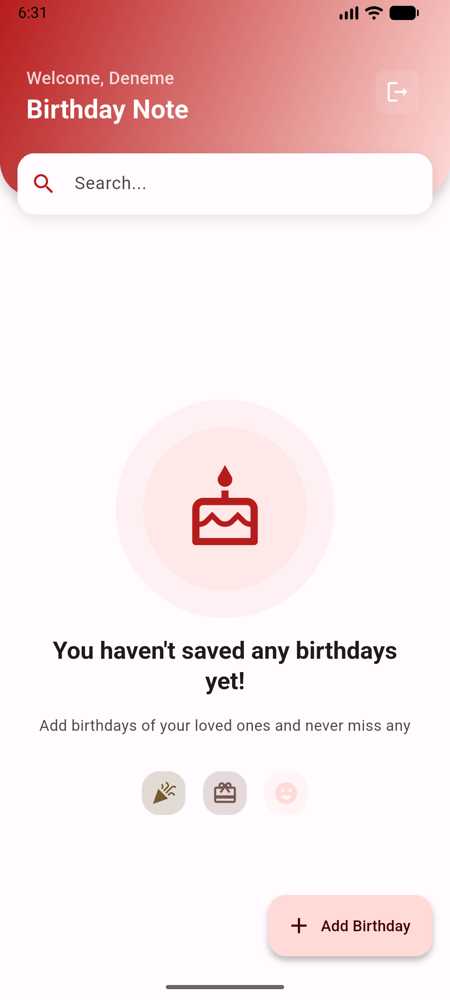
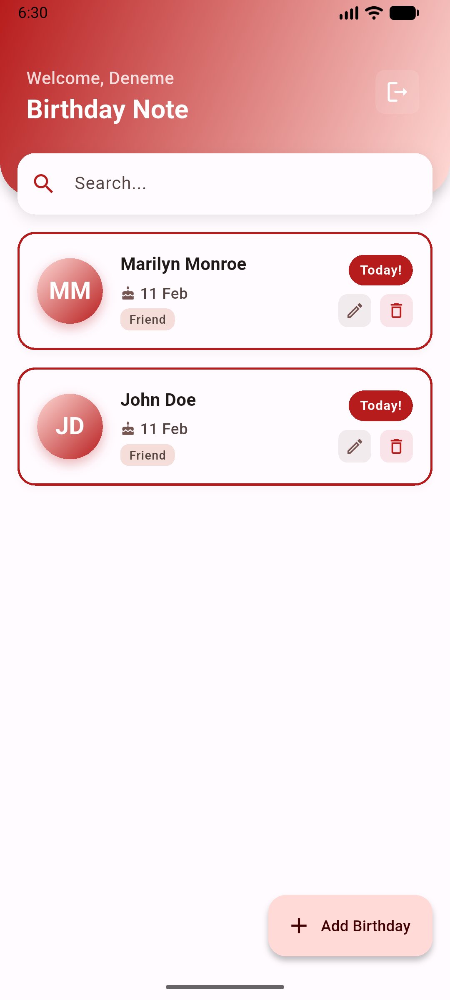
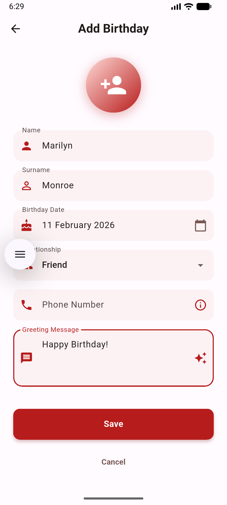
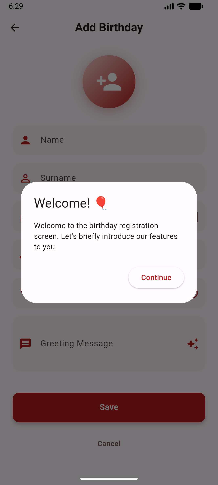
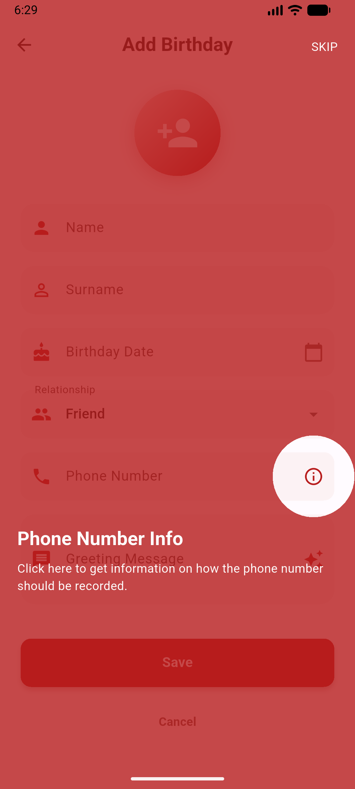

# BirthNote Application 🎂

[](https://flutter.dev)
[](https://firebase.google.com)
[](https://ai.google.dev/)

A modern, secure, and AI-powered birthday reminder application built with Flutter and Firebase.

🌍 **Languages:** **English** | [Türkçe](README_TR.md)

---

## 📸 Screenshots

| Login | Register | Empty Home | Home |
| :---: | :---: | :---: | :---: |
|  |  |  |  |
| **Birthday Form** | **Tutorial 1** | **Tutorial 2** | |
|  |  |  | |

---

## 🚀 Features

- 🔐 **Secure Authentication**: Firebase Authentication for user accounts.
- 📅 **Birthday Management**: Create, update, and manage birthdays with ease.
- 🤖 **AI Greeting Assistant**: Integration with **Google Gemini** to generate personalized birthday greetings based on relationships.
- 🔔 **Smart Notifications**: Push notifications via Firebase Cloud Messaging (FCM) to never miss a birthday.
- 💬 **WhatsApp Redirection**: Easily send generated greetings directly via WhatsApp from notifications or within the app.
- 🛡️ **Data Privacy**: Contact information is stored securely with **AES encryption**.
- 🌓 **Dynamic Theming**: Support for both Light and Dark modes.
- 🌐 **Localization**: Fully localized in English and Turkish.
- 📱 **Offline Support**: Local caching for a seamless experience even without internet.
- 🎨 **Modern UI**: Material 3 design, smooth Lottie animations, and interactive tutorials.

## 🏗️ Architecture

The project follows **Clean Architecture** principles with a feature-driven modular structure:

- **Layered Structure**:
    - **View**: UI components using widgets and mixins.
    - **Cubit (ViewModel)**: State management using the BLoC pattern.
    - **Repository**: Data abstraction layer connecting services and view models.
    - **Service**: External service integrations (Firebase, Gemini, Encryption).
- **Modularity**: Shared logic is extracted into internal modules (`core`, `common`).
- **Dependency Injection**: Centralized service locator using `GetIt`.
- **Navigation**: Type-safe routing with `AutoRoute`.

## 🛠️ Tech Stack

- **Framework**: [Flutter](https://flutter.dev)
- **State Management**: [flutter_bloc](https://pub.dev/packages/flutter_bloc)
- **Backend**: [Firebase](https://firebase.google.com) (Auth, Firestore, FCM)
- **AI**: [Google Gemini](https://pub.dev/packages/google_generative_ai)
- **Navigation**: [AutoRoute](https://pub.dev/packages/auto_route)
- **Localization**: [Easy Localization](https://pub.dev/packages/easy_localization)
- **Networking**: [Vexana](https://pub.dev/packages/vexana) & [Dio](https://pub.dev/packages/dio)
- **Storage**: [Shared Preferences](https://pub.dev/packages/shared_preferences) & [Secure Storage](https://pub.dev/packages/flutter_secure_storage)

## 📥 Installation

1.  **Clone the Repo**:
    ```bash
    git clone https://github.com/MehmetAnilcomert/birthday_reminder.git
    ```
2.  **Install Dependencies**:
    ```bash
    flutter pub get
    ```
3.  **Configure Firebase**:
    - Add your `google-services.json` (Android) and `GoogleService-Info.plist` (iOS).
    - Run `flutterfire configure` if you have the CLI installed.
4.  **Run Build Runner**:
    ```bash
    dart run build_runner build --delete-conflicting-outputs
    ```
5.  **Run the App**:
    ```bash
    flutter run
    ```
